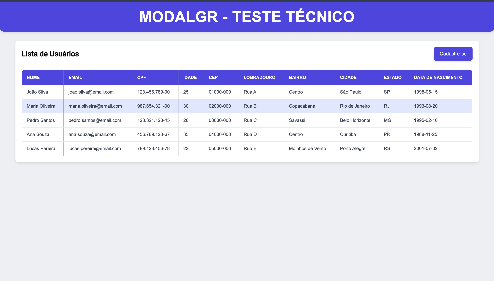

<h1>Teste ModalGr</h1>

## Aqui está uma sugestão para a descrição do seu projeto no README:

Cadastro de Usuário - SPA
Este projeto é uma aplicação simples de cadastro de usuários, onde os dados inseridos são dinamicamente exibidos em uma lista dentro de uma tabela.

### Tecnologias Utilizadas:

<li>TypeScript: Para garantir um código mais seguro e de fácil manutenção.</li>
<li>Angular: Framework utilizado para a construção da SPA.</li>
<li>Reactive Forms: Utilizado para o gerenciamento dos formulários e validações de forma reativa.</li>
<li>CSS: Estilização da aplicação para garantir uma boa experiência do usuário.</li>

Observação:

Este projeto foi desenvolvido como uma Single Page Application (SPA) e não utiliza recursos de SSR (Server-Side Rendering), já que o foco é manter a interação dinâmica do cadastro e visualização dos dados localmente no navegador.
